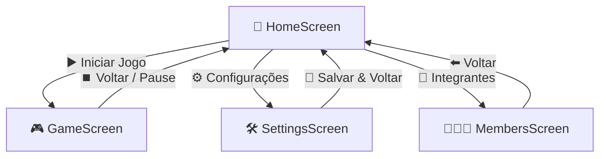
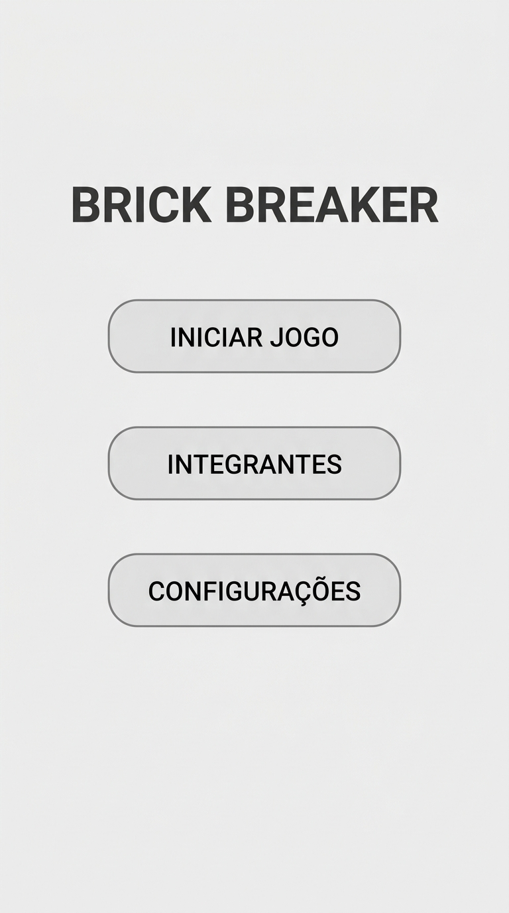
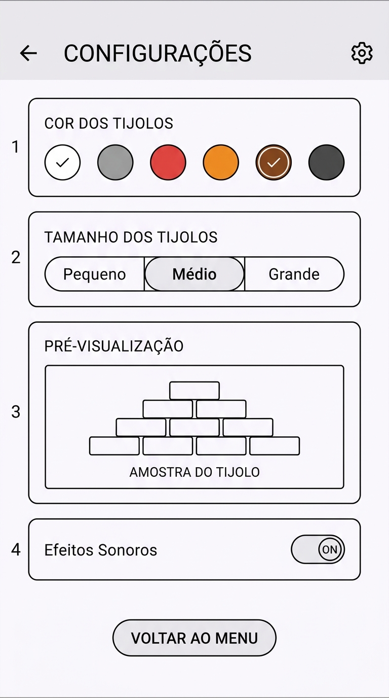
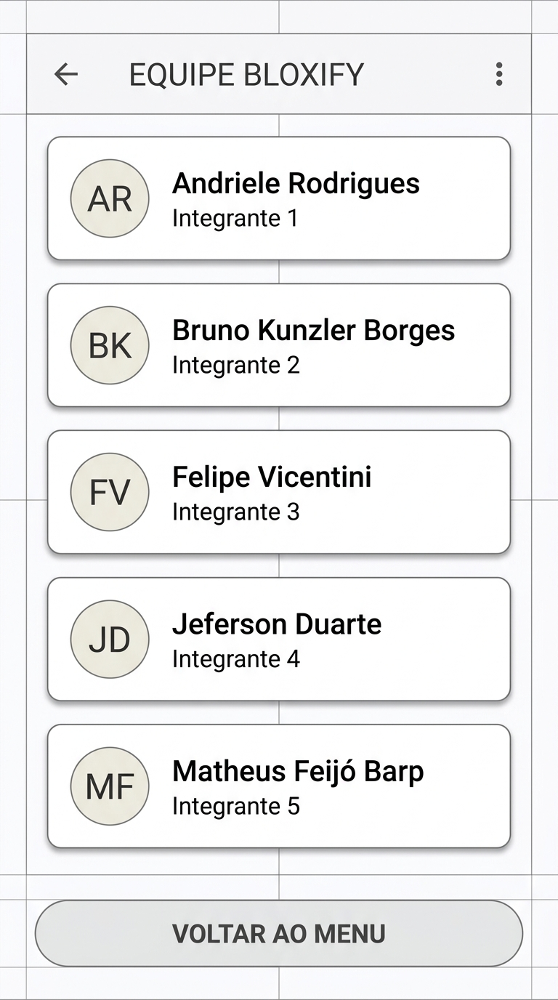
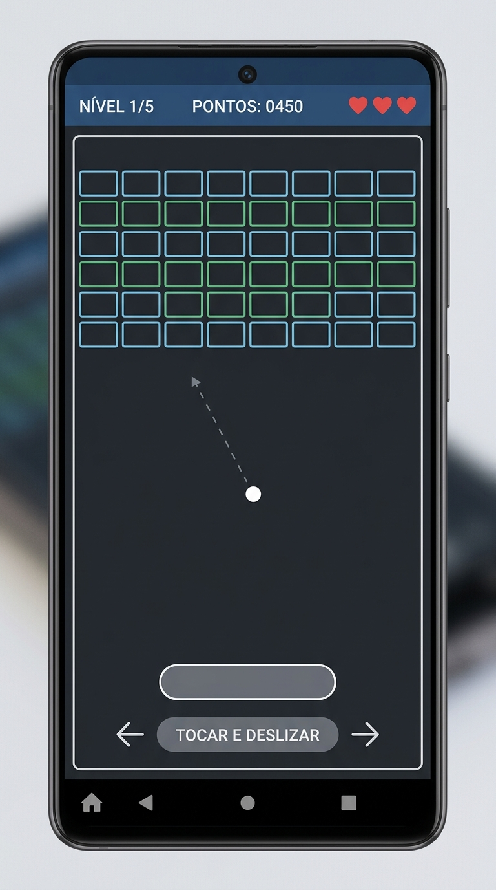

# 📱 Wireframes Estruturados do Aplicativo (Bloxify)

> **Critério de Avaliação:** Apresentação do Wireframe em alta definição de todas as telas do aplicativo, incluindo os níveis de jogos. Wireframing estruturado com hierarquia visual, especificações de interface, diagramas de fluxo de navegação e componentes em Jetpack Compose. (Peso: 4 Pontos)

---

## 1. 🗺️ Fluxo de Navegação e Arquitetura de Telas

O aplicativo segue uma arquitetura linear e desacoplada gerenciada pelo `AppNavigation.kt` via **Jetpack Navigation Compose**:



---

## 2. 📐 Wireframes Estruturados das Telas Principais

---

### 2.1. Tela Inicial (`HomeScreen.kt`)
* **Objetivo:** Ponto de entrada do usuário com acesso rápido às opções do jogo.
* **Componentes:** Título estilizado em destaque e botões de ação em Material 3.



```
+--------------------------------------------------+
|                                                  |
|                  BRICK BREAKER                   |
|                                                  |
|             +----------------------+             |
|             |     INICIAR JOGO     |             |
|             +----------------------+             |
|                                                  |
|             +----------------------+             |
|             |      INTEGRANTES     |             |
|             +----------------------+             |
|                                                  |
|             +----------------------+             |
|             |     CONFIGURAÇÕES    |             |
|             +----------------------+             |
|                                                  |
+--------------------------------------------------+
```

---

### 2.2. Tela de Configurações (`SettingsScreen.kt`)
* **Objetivo:** Personalização estética e física dos tijolos com persistência em tempo real e preview interativo.
* **Componentes:** TopAppBar com botão de voltar, seleção de paleta de cores (chips de cor), seleção de tamanho dos blocos, switch de efeitos sonoros e painel de demonstração em tempo real (*Live Preview*).



```
+--------------------------------------------------+
| [⬅️ Voltar]         CONFIGURAÇÕES                |
+--------------------------------------------------+
|                                                  |
|  🎨 COR DOS TIJOLOS                              |
|  Selecione a paleta visual dos blocos:           |
|                                                  |
|   (🔵 Ciano)  (🟢 Verde)  (🟡 Amarelo)           |
|   (🟣 Roxo)   (🔴 Laranja)(⚪ Clássico)          |
|                                                  |
| ------------------------------------------------ |
|                                                  |
|  📏 TAMANHO DOS TIJOLOS                          |
|  Define largura/altura relativa dos blocos:      |
|                                                  |
|   [ Pequeno ]    [ Médio (Padrão) ]   [ Grande ] |
|                                                  |
| ------------------------------------------------ |
|                                                  |
|  👁️ PRÉ-VISUALIZAÇÃO AO VIVO:                    |
|  +--------------------------------------------+  |
|  |   [ BLOCO 1 ]   [ BLOCO 2 ]   [ BLOCO 3 ]  |  |
|  |     (Cor selecionada e escala aplicada)    |  |
|  +--------------------------------------------+  |
|                                                  |
|  🔊 Efeitos Sonoros: [ Ligado / Desligado ]     |
|                                                  |
|  💾 [ Salvo Automaticamente via SharedPreferences ]
+--------------------------------------------------+
```

---

### 2.3. Tela de Integrantes (`MembersScreen.kt`)
* **Objetivo:** Exibição elegante e padronizada dos 5 membros responsáveis pelo desenvolvimento do projeto.
* **Componentes:** TopAppBar, lista vertical de cards com avatares estilizados, nomes completos e identificador de equipe.



```
+--------------------------------------------------+
| [⬅️ Voltar]          INTEGRANTES                 |
+--------------------------------------------------+
|  Equipe de Desenvolvimento • Projeto Bloxify     |
|                                                  |
|  +--------------------------------------------+  |
|  | [👤]  1. ANDRIELE RODRIGUES                |  |
|  |       Desenvolvedora Android / Bloxify     |  |
|  +--------------------------------------------+  |
|                                                  |
|  +--------------------------------------------+  |
|  | [👤]  2. BRUNO KUNZLER BORGES              |  |
|  |       Desenvolvedor Android / Bloxify      |  |
|  +--------------------------------------------+  |
|                                                  |
|  +--------------------------------------------+  |
|  | [👤]  3. FELIPE VICENTINI                  |  |
|  |       Desenvolvedor Android / Bloxify      |  |
|  +--------------------------------------------+  |
|                                                  |
|  +--------------------------------------------+  |
|  | [👤]  4. JEFERSON DUARTE                   |  |
|  |       Desenvolvedor Android / Bloxify      |  |
|  +--------------------------------------------+  |
|                                                  |
|  +--------------------------------------------+  |
|  | [👤]  5. MATHEUS FEIJÓ BARP                |  |
|  |       Desenvolvedor Android / Bloxify      |  |
|  +--------------------------------------------+  |
|                                                  |
|            Engenharia de Software 2026           |
+--------------------------------------------------+
```

---

## 3. 🎮 Wireframes Estruturados dos Níveis do Jogo (`GameScreen.kt`)

O jogo opera em uma matriz de renderização proporcional de **5 Linhas × 8 Colunas**, com limites físicos (paredes) e detecção contínua de colisão.



---

### 3.1. Nível 1: Clássico (Preenchimento Total)
* **Padrão:** Matriz 100% preenchida (40 blocos). Introdução às mecânicas de rebatimento e física.

```
+--------------------------------------------------+
| [🏠] NÍVEL 1/5       PONTOS: 0450       VIDAS: ❤️❤️❤️|
+==================================================+
|  [#][#][#][#][#][#][#][#]  <- Linha 1 (100 pts)  |
|  [#][#][#][#][#][#][#][#]  <- Linha 2 (80 pts)   |
|  [#][#][#][#][#][#][#][#]  <- Linha 3 (60 pts)   |
|  [#][#][#][#][#][#][#][#]  <- Linha 4 (40 pts)   |
|  [#][#][#][#][#][#][#][#]  <- Linha 5 (20 pts)   |
|                                                  |
|                                                  |
|                        ⚪ (Bola em movimento)    |
|                       ↗                          |
|                                                  |
|                                                  |
|                 [==== PADDLE ====]               |
|                      (Toque / Arraste ↔)         |
+--------------------------------------------------+
```

---

### 3.2. Nível 2: Pirâmide Invertida
* **Padrão:** Estrutura afunilada em V invertido exigindo pontaria para acertar os blocos superiores.

```
+--------------------------------------------------+
| [🏠] NÍVEL 2/5       PONTOS: 1200       VIDAS: ❤️❤️❤️|
+==================================================+
|  [#][#][#][#][#][#][#][#]                        |
|     [#][#][#][#][#][#]                           |
|        [#][#][#][#]                              |
|           [#][#]                                 |
|                                                  |
|                                                  |
|                   ⚪                             |
|                                                  |
|              [==== PADDLE ====]                  |
+--------------------------------------------------+
```

---

### 3.3. Nível 3: Muralhas e Colunas Alternadas
* **Padrão:** Pilares espaçados que criam corredores para a bola penetrar e quicar internamente.

```
+--------------------------------------------------+
| [🏠] NÍVEL 3/5       PONTOS: 2100       VIDAS: ❤️❤️ |
+==================================================+
|  [#]   [#]   [#]   [#]                           |
|  [#]   [#]   [#]   [#]                           |
|  [#]   [#]   [#]   [#]                           |
|  [#]   [#]   [#]   [#]                           |
|  [#]   [#]   [#]   [#]                           |
|                                                  |
|                      ⚪                           |
|                                                  |
|              [==== PADDLE ====]                  |
+--------------------------------------------------+
```

---

### 3.4. Nível 4: Xadrez / Tabuleiro Espalhado
* **Padrão:** Blocos intercalados em padrão quadriculado (*Checkered pattern*).

```
+--------------------------------------------------+
| [🏠] NÍVEL 4/5       PONTOS: 3400       VIDAS: ❤️❤️ |
+==================================================+
|  [#]  .  [#]  .  [#]  .  [#]  .                  |
|   .  [#]  .  [#]  .  [#]  .  [#]                 |
|  [#]  .  [#]  .  [#]  .  [#]  .                  |
|   .  [#]  .  [#]  .  [#]  .  [#]                 |
|  [#]  .  [#]  .  [#]  .  [#]  .                  |
|                                                  |
|              ⚪                                   |
|                                                  |
|              [==== PADDLE ====]                  |
+--------------------------------------------------+
```

---

### 3.5. Nível 5: Labirinto / Geração Procedural Aleatória
* **Padrão:** Geração pseudo-aleatória equilibrada que garante que todos os blocos sejam acessíveis.

```
+--------------------------------------------------+
| [🏠] NÍVEL 5/5       PONTOS: 4800       VIDAS: ❤️  |
+==================================================+
|  [#][#]  .  [#][#]  .  [#][#]                    |
|   .  [#][#]  .  [#][#]  .  [#]                   |
|  [#]  .  [#][#]  .  [#][#]  .                    |
|  [#][#][#]  .  .  [#][#][#]                      |
|                                                  |
|                                                  |
|                       ⚪                         |
|                                                  |
|              [==== PADDLE ====]                  |
+--------------------------------------------------+
```
